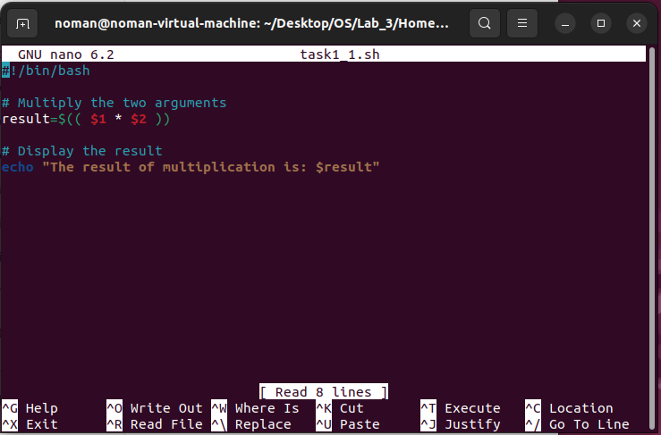

# Task 1

### Helping Mr. Tom to learn Shell Scripting

###### 1.  Create a simple script which will take two command line arguments and  then multiply them together

{.center width=50%}

{.center width=50%}

###### 2.   Create a simple script, which will ask the user for a few pieces of  information then combine this into a message which is echo'd to the screen.

{.center width=50%}

{.center width=50%}

###### 3.   Now Mr. Tom suddenly lost the track of his current location. Help him find his location.

{.center width=50%}

{.center width=50%}

###### 4.    He wants the list of all files present on home directory

{.center width=50%}

{.center width=50%}

###### 5.   Display the current time.

{.center width=50%}

{.center width=50%}

###### 6.   He is done with the task and he is happy with your work. He want to  display a thankyou message.

{.center width=50%}

{.center width=50%}

# Task 2

###### 1.   Write a simple shell script that uses arithmetic operators (+, -,*) using  double parenthesis with printing your own roll # with the results of  operations.

{.center width=50%}

{.center width=50%}

###### 2.  Write a simple shell script that uses all relational operators with printing  your own roll # with the results of operations.

{.center width=50%}

{.center width=50%}

##### Git Link :: [My Github Link](https://github.com/NomanAli42856/4th_Semester/tree/main/OS/InstallWindows)
